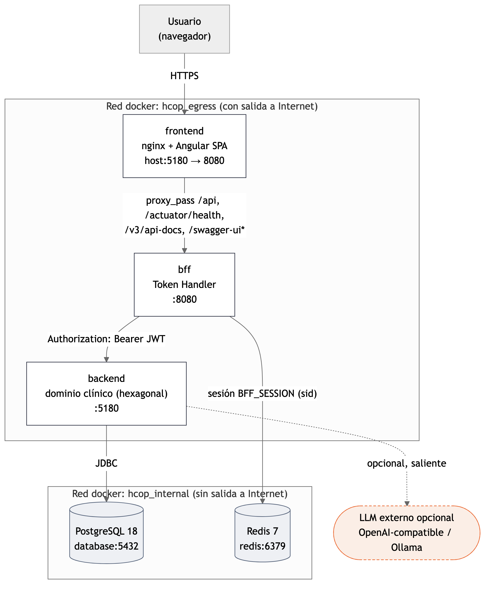

# HCOP JP

Historia clínica oncológica, diagnósticos, prescripciones, protocolos,
farmacia, Hospital de Día, turnero por sillón, estudios, herramientas,
usuarios y auditoría, en un solo sistema.

Hospital de Día opera cada aplicación (ciclo + día) con un circuito único:
prescripción → validación y disponibilidad de medicación → turno → triaje →
preparación trazable con TTL → administración con doble control → cierre.
Cada rol trabaja en su propia cola, sin poder adelantar estados.

## Instalar y ejecutar

**No tenés Docker instalado / no sos técnico:**

1. Descargá [`INSTALAR-DESDE-GITHUB.bat`](INSTALAR-DESDE-GITHUB.bat) y
   hacé doble clic.
2. Aceptá instalar Docker Desktop si Windows lo pide.
3. Elegí puerto, usuario y contraseña (o Enter para los valores sugeridos).
4. Se abre solo en `http://localhost:<puerto>/`.

El acceso directo **HCOP JP** que deja en el Escritorio sirve como lanzador
diario: revisa Docker, actualiza a la última versión publicada y abre el
sistema. Detalle completo: [INSTALACION-DESDE-GITHUB.md](docs/00-inicio/INSTALACION-DESDE-GITHUB.md).

**Ya tenés Docker Desktop abierto:**

Descargá [`EJECUTAR-DOCKER-DESDE-GITHUB.ps1`](EJECUTAR-DOCKER-DESDE-GITHUB.ps1)
y ejecutalo — no hace falta clonar el repo, Java ni Maven.

```powershell
powershell.exe -File .\EJECUTAR-DOCKER-DESDE-GITHUB.ps1 -Mode Start   # usa imágenes locales, descarga si faltan
powershell.exe -File .\EJECUTAR-DOCKER-DESDE-GITHUB.ps1 -Mode Update  # fuerza latest
powershell.exe -File .\EJECUTAR-DOCKER-DESDE-GITHUB.ps1 -Mode Stop
```

En el primer inicio pide puerto, usuario admin y contraseña (mín. 10
caracteres, sin valor por defecto) y genera el resto de los secretos.
Los pacientes y archivos clínicos nunca están en GitHub ni en la imagen —
quedan en volúmenes Docker locales. Repo e imágenes son públicos: ninguna
de las dos vías pide login en GitHub.

Una vez arriba: `http://localhost:<puerto>/` (app), `/swagger-ui.html`
(API), `/actuator/health` (salud).

## Arquitectura



- **`frontend/`** — Angular + nginx. Único punto público; enruta `/api/`
  hacia el `bff`.
- **`bff/`** — Java 21 + Redis. Token Handler: guarda el JWT del backend en
  Redis, le da al navegador una cookie de sesión opaca (`BFF_SESSION`).
  El navegador nunca ve el JWT ni habla directo con `backend`.
- **`backend/`** — Java 21, Spring MVC, PostgreSQL. ~14 módulos clínicos en
  arquitectura hexagonal (`domain`/`application`/`infrastructure`),
  reforzada con ArchUnit. Flyway versiona el esquema; las reglas de
  concurrencia críticas (ej. superposición de turnos) están protegidas en
  PostgreSQL, no solo en la UI.

Más diagramas (secuencias de login/request, modelo de datos por dominio):
[`docs/diagrams/`](docs/diagrams/README.md). Detalle de la arquitectura
hexagonal: [`HEXAGONAL.md`](docs/02-arquitectura/HEXAGONAL.md).

## Documentación

Empezar por el [índice de documentación](docs/README.md).

- [Instalar desde GitHub](docs/00-inicio/INSTALACION-DESDE-GITHUB.md)
- [Manual de uso](docs/01-uso/MANUAL-DE-USO.md)
- [Flujo clínico](docs/01-uso/FLUJO-TRATAMIENTO.md)
- [Circuito de Hospital de Día en 7 pasos](docs/01-uso/CIRCUITO-HOSPITAL-DE-DIA-7-PASOS.md)
- [Guía operativa por roles](docs/01-uso/GUIA-POR-ROLES-HOSPITAL-DE-DIA.md)
- [Video del circuito paso a paso](frontend/public/help/media/circuito-hospital-dia-paso-a-paso.mp4)
- [Swagger y todos los endpoints](docs/02-arquitectura/SWAGGER-OPENAPI.md)
- [Modelo y diccionario de datos](docs/03-base-de-datos/MODELO-DE-DATOS.md)
- [Mapa pantalla → API → base](docs/07-referencia/MAPA-FUNCIONAL.md)
- [Variables de entorno](docs/05-operacion/VARIABLES-DE-ENTORNO.md)
- [Estructura del repositorio](docs/04-desarrollo/ESTRUCTURA-DEL-REPOSITORIO.md)
- [Docker](docs/05-operacion/DOCKER.md) · [Backups](docs/05-operacion/BACKUP-Y-RESTAURACION.md) · [Seguridad](docs/05-operacion/SEGURIDAD.md)

## Verificación

GitHub Actions compila `backend`/`bff`/`frontend`, corre sus pruebas
(incluida la suite ArchUnit) y levanta el producto completo con Docker
antes de publicar imagen. Localmente:

```powershell
powershell.exe -NoProfile -ExecutionPolicy Bypass -File .\scripts\integration-test.ps1
```

Recorre login, paciente, diagnóstico, tratamiento multidroga, Farmacia,
turno, triaje, preparación, QR, interrupción/reanudación y administración.
Última corrida de la [matriz de 100 casos de Hospital de Día](docs/08-auditoria/HOSPITAL-DIA-100-CASOS.md):
[100/100 PASS](docs/08-auditoria/resultados/hospital-dia-100-casos-20260730-100711.md).
