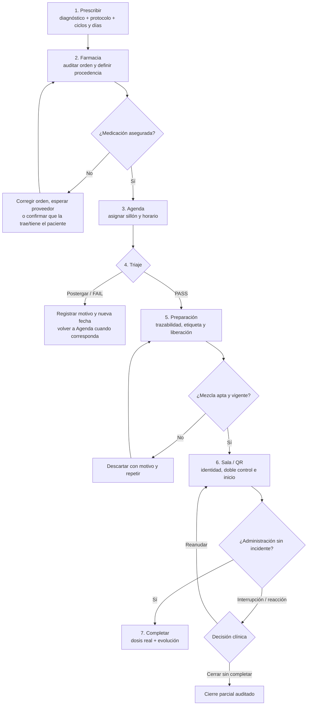

# Video guiado del circuito de Hospital de día

## Qué muestra

El video detallado recorre una aplicación oncológica completa con un paciente
ficticio. No se limita a enumerar las siete etapas: señala con un recuadro el
control que se está explicando, muestra el movimiento del puntero y describe qué
ocurre en cada alternativa operativa.

- [Ver el video detallado dentro del sistema](http://localhost:5180/help/media/circuito-hospital-dia-paso-a-paso.mp4)
- [Abrir el MP4 desde el repositorio](../../src/main/resources/static/help/media/circuito-hospital-dia-paso-a-paso.mp4)
- [Descargar los subtítulos editables](../media/demo-flujo-7-pasos/circuito-hospital-dia-paso-a-paso.srt)
- [Ver el resumen de 70 segundos](../media/demo-flujo-7-pasos/flujo-oncologico-7-pasos.mp4)

Los subtítulos principales son **azul intenso**, tienen contraste claro y
describen la acción, la condición previa y el resultado esperado. Los recuadros
azules son marcas didácticas del video: no forman parte de la información
clínica ni cambian datos.

## Mapa del circuito

La unidad del recorrido es:

`paciente + tratamiento + ciclo + día de aplicación`

Por eso un protocolo con medicación en los días 1, 8 y 15 genera tres
aplicaciones operativas independientes. Cada una puede tener su propio turno,
triaje, preparación, administración y cierre.

## Capítulos del video

### 1. Ubicar al paciente y prescribir

El video muestra cómo abrir el paciente, comprobar nombre y DNI y entrar en
**Hospital de día → Nuevo tratamiento**. Luego señala:

1. diagnóstico al que se asociará la indicación;
2. protocolo y drogas;
3. cantidad de ciclos y días de aplicación;
4. fecha inicial y proyección de fechas;
5. dosis, unidad, vía, duración y requisitos previos;
6. guardado del tratamiento y aparición de sus aplicaciones.

También explica que una pauta exclusivamente oral o domiciliaria permanece en
el plan terapéutico, pero no crea una cola, un sillón ni un QR de Hospital de
día.

### 2. Encontrar al paciente en Farmacia

Se remarca la cola de **Farmacia**, el buscador y sus filtros. La demostración
busca por nombre y DNI, abre la aplicación exacta y enseña las alternativas de
procedencia:

| Alternativa | Cuándo usarla | Consecuencia operativa |
|---|---|---|
| Stock del centro | La institución aporta la medicación | Se validan y reservan todos los componentes de esa aplicación |
| Debe traerla el paciente | El paciente aún debe entregarla | La aplicación sigue identificada como pendiente |
| La tiene el paciente | El paciente confirma que la conserva | Queda diferenciada de la medicación recibida por el centro |
| Recibida en el centro | La medicación ya ingresó físicamente | Farmacia documenta su recepción |
| Pendiente del proveedor | Todavía no fue entregada | No debe confundirse con stock disponible |
| Rechazar / corregir orden | La prescripción es incompleta o inconsistente | Vuelve al médico con el motivo documentado |

Para stock institucional, el video señala que cada droga debe coincidir con la
orden en nombre, dosis, unidad y cantidad. La reserva de una aplicación no
autoriza automáticamente otra fecha del mismo ciclo.

### 3. Dar un turno en un sillón

Este capítulo muestra el gesto completo solicitado:

1. abre **Turnos y sala → Agenda**;
2. remarca el cuadro **Pacientes prescriptos**;
3. explica los filtros por prescripción y disponibilidad de medicación;
4. usa el buscador por paciente, DNI, esquema o diagnóstico;
5. selecciona una tarjeta y muestra en celeste todos los lugares donde cabe;
6. arrastra la tarjeta al sillón y hora elegidos;
7. muestra en verde el bloque válido que ocupará según su duración;
8. muestra en rojo rayado un destino inválido o superpuesto;
9. suelta sobre el destino válido y comprueba sillón y franja horaria.

El bloque queda **azul** mientras el turno no está confirmado y **rojo** cuando
se confirma. El video también señala todas las acciones del turno:

- **hoja**: abre el resumen completo del paciente y de la aplicación;
- **mover**: permite arrastrar el turno ya colocado a otra franja;
- **X**: exige un motivo, libera las celdas y devuelve la aplicación a espera;
- **flechas laterales**: muestran otros grupos de sillones;
- **lupas**: cambian cuántos sillones se ven al mismo tiempo;
- **calendario**: cambia el día operativo sin perder la fecha seleccionada.

Si el bloque no cabe dentro de la jornada o se cruza con otro turno, el servidor
lo rechaza aunque el navegador hubiera mostrado una posición transitoria.

### 3 bis. Resolver bloqueos, suspensión y continuidad

La acción **Gestionar** de una tarjeta pendiente no equivale a dar un turno. El
video diferencia sus posibilidades:

- **Solicitar prescripción**: elige un médico habilitado, envía la solicitud a
  su bandeja y mantiene bloqueada la aplicación hasta la respuesta;
- **Solicitar continuidad**: pide una decisión médica antes de avanzar con el
  siguiente ciclo;
- **Suspender transitoriamente**: conserva el tratamiento y el ciclo detenido,
  exige motivo y puede registrar una fecha orientativa;
- **Suspender definitivamente**: retira los ciclos futuros; si luego existe una
  nueva indicación debe crearse otro tratamiento;
- **Reanudar**: sólo aparece para una suspensión transitoria después de obtener
  la nueva confirmación requerida y continúa desde el ciclo detenido;
- **Resolver desde la campana**: el destinatario puede confirmar, rechazar,
  suspender transitoriamente o suspender definitivamente según el tipo de
  solicitud.

Cada alternativa crea su evolución auditada. Cerrar el modal con la X descarta
la edición en curso; no confirma silenciosamente ninguna decisión.

### 4. Realizar el triaje

La cola de **Triaje** se muestra ordenada por hora del turno. El video abre
**Evaluar**, señala laboratorio, signos vitales, peso, ECOG, toxicidad y
observaciones, y compara sus dos salidas:

- **PASS**: deja la aplicación habilitada para Preparación;
- **Postergar / FAIL**: exige motivo y puede proponer una nueva fecha; la
  aplicación sale del circuito del día hasta que sea reprogramada.

No se muestra un atajo para saltar el triaje. Si faltan los datos obligatorios,
la interfaz explica qué debe completarse.

### 5. Preparar, etiquetar y liberar

El video busca la aplicación autorizada, inicia la preparación y recorre cada
droga por separado. Señala lote, vencimiento, cantidad y unidad, diluyente,
volumen final, concentración, vida útil y segundo control. Después muestra:

1. **Registrar mezcla lista**;
2. **Imprimir etiqueta**;
3. **Liberar a sala**.

También incluye la alternativa **Mezcla vencida / Descartar y repetir**. Esa
acción exige un motivo, conserva la traza previa y vuelve a habilitar una
preparación segura. No puede descartarse por esta vía una mezcla cuya
administración ya comenzó.

### 6. Identificar e iniciar en Sala

Se muestran las dos entradas equivalentes a la ficha canónica:

- abrir la aplicación desde **Sala de hoy**;
- escanear el QR por cámara, imagen o contenido pegado.

El QR identifica paciente, tratamiento, ciclo y día; no administra por sí
solo. Antes de iniciar, el video remarca nombre, DNI, pulsera, etiqueta, droga,
dosis, vía, lote, vencimiento, velocidad y segundo verificador.

### 7. Cerrar o resolver una interrupción

El cierre normal registra hora final, dosis realmente administrada, tolerancia
y observación. La alternativa ante un incidente usa
**Interrumpir / reacción** y exige:

- hora y motivo;
- dosis parcial;
- medidas adoptadas;
- condición del paciente;
- destino clínico.

Luego se muestran las dos decisiones posibles:

- **Reanudar administración**, si la preparación sigue vigente y la decisión
  clínica lo permite;
- **Cerrar sin completar**, conservando la dosis parcial y la reacción.

Si se reanuda y finalmente se completa, la evolución conserva la interrupción,
su resolución y la dosis administrada; no se reemplaza por un cierre
aparentemente normal.

### 8. Comprobar el resultado

Al final se abre **Tratamientos → Aplicaciones** para verificar el árbol
`ciclo → día → aplicación`, el turno real, Farmacia, Triaje, Preparación,
Administración y las evoluciones generadas. Esta vista es longitudinal y de
consulta: las acciones operativas siguen realizándose en sus pestañas
específicas.

El video señala además los documentos disponibles en cada fila:

- hoja azul de consentimiento: abre el archivo existente;
- hoja roja: informa que el consentimiento no está disponible;
- prescripción: descarga el documento cuando fue almacenado;
- hoja de tratamiento: genera la hoja del ciclo elegido;
- QR: genera la identificación de esa aplicación;
- actualizar: vuelve a consultar el detalle sin reconstruir ni modificar la
  historia.

Los indicadores de Turno y Farmacia del detalle son de sólo lectura. Para
modificarlos se vuelve a **Agenda** o **Farmacia**, evitando dos caminos para la
misma decisión.

## Cómo usar este material para capacitar

1. Reproduzca primero el video completo sin detenerlo para presentar el
   recorrido.
2. Repita el capítulo correspondiente al rol que se está capacitando.
3. Pause antes de cada decisión y pida al usuario que identifique la condición
   previa.
4. Practique después en una base de prueba con un paciente ficticio.
5. Simule al menos una alternativa adversa: turno superpuesto, postergación,
   mezcla vencida o interrupción.

El video es material de capacitación y no reemplaza el criterio clínico, la
validación institucional ni los procedimientos de seguridad de medicamentos.
