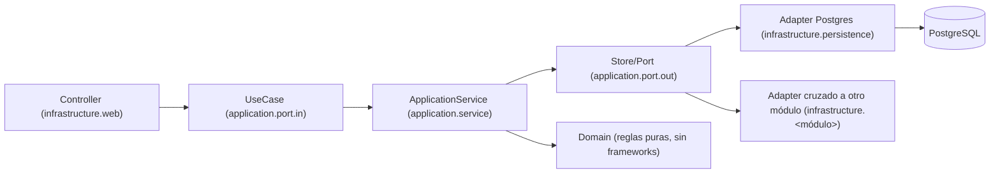

# Arquitectura hexagonal

HCOP JP usa Spring Boot 4, Java 21, Spring MVC y PostgreSQL, desplegado como
tres servicios Docker (`backend`, `bff`, `frontend`) detrás de nginx (ver
`docs/09-migracion-bff/`). Dentro del `backend`, cada módulo clínico sigue
arquitectura hexagonal (puertos y adaptadores): dominio puro, casos de uso
aislados de HTTP/SQL/JSON, y adaptadores intercambiables.



## Capas por módulo

Cada módulo (`patient`, `treatment`, `infusion`, `admin`, `catalog`, `media`,
`integration`, etc.) tiene la misma forma:

- **`domain/`** — entidades y reglas de negocio en Java puro. Nunca importa
  Spring, JDBC, Jackson (`tools.jackson`) ni ningún framework — se prueba sin
  infraestructura (`HexagonalArchitectureTest.domainIsIndependentFromFrameworks`).
- **`application/port/in/`** — casos de uso (`*UseCase`), la API de entrada
  del módulo. Comandos/resultados van como records anidados.
- **`application/port/out/`** — puertos de salida (`*Store` para
  persistencia, `*Port` para todo lo demás, `*Exception` para las
  excepciones de puerto). Es lo único que `application` conoce del exterior.
- **`application/service/`** — `*ApplicationService` (implementa el/los
  `*UseCase`, `final`, sin `@Service`, instanciable en test sin Spring) y
  `*Failure` (error funcional del módulo, independiente de HTTP —
  `INVALID`/`NOT_FOUND`/`CONFLICT`/… según lo que el módulo necesite).
- **`infrastructure/web/`** — `*Controller` (traduce HTTP, sin lógica) y
  `*FailureAdvice` (`@RestControllerAdvice` que mapea el `*Failure` del
  módulo a `HttpStatus`; es el único lugar de `infrastructure.web` que puede
  importar `application.service`, ver R6 abajo).
- **`infrastructure/persistence/`** — adaptadores JDBC del módulo (`Postgres*Store`).
- **`infrastructure/<módulo-cruzado>/`** — cuando un módulo necesita datos de
  otro que está "aguas abajo" en el orden canónico (ver más abajo), define un
  puerto de salida propio y el adaptador vive en el módulo dueño de los
  datos — nunca al revés.
- **`infrastructure/configuration/`** — el wiring de Spring: variante A
  (`@Service`+`@Transactional` por método, delegando al `ApplicationService`)
  o variante B (`@Configuration`+`@Bean`, para módulos de solo lectura).

## Puertos cruzados y orden canónico

Ningún módulo importa las clases concretas de otro directamente — cruza
mediante un puerto de salida propio, implementado por un adaptador que vive
físicamente en el módulo dueño de los datos. El orden canónico que evita
ciclos es:

```
patient (base) ← treatment ← infusion
```

`treatment` puede depender directo de `patient`; `infusion` puede depender
directo de `patient` y `treatment`. Cualquier dependencia "hacia abajo" (p. ej.
`patient` necesitando algo de `treatment`) se invierte con un puerto —
ejemplos reales: `patient.application.port.out.{TreatmentSummaryPort,
InfusionSummaryPort}`, `treatment.application.port.out.{InfusionSummaryPort,
InfusionAppointmentPort,TreatmentApplicationSyncPort}`. `diagnosis`, `qr`,
`workflow` y `media` cruzan a `patient` en el sentido permitido (puerto de
salida propio, adaptador en `patient` — p. ej.
`media.application.port.out.PatientLookupPort`).

Cuando el puerto cruzado propaga un fallo del módulo aguas abajo (paciente
inexistente, conflicto de revisión), el adaptador lo traduce a su propio
`*Failure` en el borde — nunca deja pasar la excepción del otro módulo sin
traducir, para que su propio `*FailureAdvice` la capture con el status HTTP
correcto (ver DECISIONES-F3.md, hallazgo de F3.4).

## `auth` y `platform`: infraestructura permanentemente exenta

Dos módulos nunca se hexagonalizan — son infraestructura transversal, no
features clínicos:

- **`auth`** — sesión JWT, `AuthContext`/`AuthInterceptor`/`SessionPrincipal`.
  Nació ya como una reescritura completa en F2; retocarlo en capas no aporta.
- **`platform`** — fusión de los antiguos `common` (contrato de error HTTP:
  `platform.web.ApiException`/`ApiExceptionHandler`/`ApiErrorResponse`/
  `AuthenticationRequiredResponse`) y `config` (bootstrap, `HcopProperties`,
  `OpenApiConfiguration`, `SecurityConfiguration`, `WebConfiguration`). No
  tiene capas `domain`/`application`/`infrastructure` — es pegamento de
  Spring.

`ApiException` (en `platform.web`) sigue siendo el vehículo legítimo para
validaciones puramente de forma HTTP hechas directo en `infrastructure.web`
(p. ej. "¿el body trae un campo obligatorio?", "¿el Content-Length es
razonable?") — el controller no puede lanzar el `*Failure` del propio módulo
(regla R6 de `HexagonalArchitectureTest`, el controller solo conoce el puerto
de entrada), así que esas comprobaciones de borde quedan en `ApiException`,
igual que las de `auth`. Todo lo demás — reglas de negocio, protocolo de
adapters de persistencia/HTTP externo — usa el `*Failure` propio del módulo.

`auth` y `platform` se acoplan mutuamente (auth construye `ApiException`;
`platform.SecurityConfiguration`/`WebConfiguration`/`BootstrapConfiguration`
conectan los beans de `auth` en Spring) — es esperado entre los dos únicos
módulos "pegamento" y no participa del grafo de ciclos que
`HexagonalArchitectureTest` vigila entre los ~14 módulos clínicos
(`r4_slicesAreFreeOfCycles` excluye ambos del escaneo).

Cuando un módulo necesita registrar trabajo de arranque (seed de datos), no
hace que `platform` dependa de sus clases concretas — implementa
`platform.BootstrapTask` y `platform.BootstrapConfiguration` recolecta
`List<BootstrapTask>` (Spring las ordena por `@Order`). Evita el ciclo
`platform`↔módulo (ver DECISIONES-F3.md).

## Guardianes automáticos

`HexagonalArchitectureTest` (ArchUnit) — reglas R1-R9 + R4a/R4b, todas en
verde sin relajar nada desde el cierre de F3:

- Dominio sin frameworks, `application` sin infraestructura ni `ApiException`.
- Solo `infrastructure.persistence`/`infrastructure.catalog` tocan JDBC.
- `RestController` solo en `infrastructure.web`; el web solo conoce el
  puerto de entrada (`*Advice` es la única excepción).
- `*ApplicationService` es `final`, no es un bean de Spring en sí mismo.
- `@Transactional` solo en `infrastructure`.
- Naming de puertos: `*UseCase` (entrada), `*Store`/`*Port`/`*Exception` (salida).
- Los ~14 módulos clínicos están libres de ciclos entre sí (`r4_slicesAreFreeOfCycles`).

`OpenApiDocumentationKeysTest` — cada clave `Controller.metodo` de
`OpenApiConfiguration` resuelve a un `@RestController` y un método reales.

`scripts/generate-openapi-snapshot.ps1 -Check` — el contrato HTTP externo
(`docs/02-arquitectura/openapi-snapshot.json`) no cambia sin que el commit lo
declare explícitamente; diff vacío es criterio de aceptación bloqueante antes
de mergear a `main`.

## Módulos

`auth` · `admin` · `patient` · `diagnosis` · `treatment` · `workflow` ·
`infusion` · `qr` · `configuration` · `catalog` · `guide` · `protocol` ·
`media` · `integration` · `system` · `platform`.

Historia completa de la migración (BFF, JWT, hexagonal) en
`docs/09-migracion-bff/PROGRESO.md` y `DECISIONES-F3.md`.
