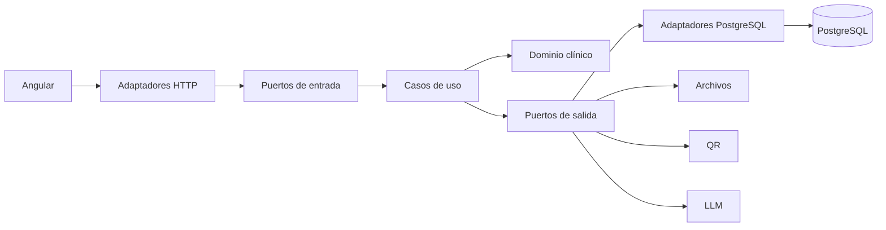

# Arquitectura objetivo de HCOP AJP

HCOP AJP será un monolito modular con arquitectura hexagonal, frontend Angular
y PostgreSQL. Se construirá y desplegará como un único producto, sin convertir
el circuito clínico en microservicios distribuidos.

## Vista general



Las dependencias de código apuntan hacia el dominio. PostgreSQL, Spring MVC,
Jackson, OpenAPI, archivos y LLM son detalles externos conectados mediante
adaptadores.

## Estructura de cada módulo

```text
ar.com.hexium.hcop.<modulo>
├── domain
│   ├── model
│   ├── valueobject
│   ├── policy
│   ├── event
│   └── exception
├── application
│   ├── port
│   │   ├── in
│   │   └── out
│   ├── command
│   ├── query
│   └── service
└── infrastructure
    ├── web
    ├── persistence
    ├── security
    ├── integration
    └── configuration
```

### Dominio

- Java puro.
- Entidades, agregados, objetos de valor, políticas y eventos.
- No importa clases de Spring, Servlet, JDBC, Jackson, OpenAPI ni PostgreSQL.
- Rechaza estados inválidos aunque la interfaz ya los haya validado.
- Trabaja con conceptos clínicos, no con filas SQL ni cuerpos HTTP.

### Aplicación

- Define los casos de uso disponibles.
- Recibe comandos y consultas tipados.
- Coordina agregados y puertos de salida.
- Define idempotencia, autorización funcional y límites transaccionales.
- No conoce controladores, `JdbcTemplate` ni rutas de archivos concretas.

### Adaptadores de entrada

- Controladores REST y mapeo de DTO.
- Validación sintáctica del contrato.
- Resolución de sesión y permiso.
- Traducción de errores de aplicación a estados HTTP.
- Sin SQL ni decisiones clínicas complejas.

### Adaptadores de salida

- SQL parametrizado mediante `JdbcTemplate`.
- Persistencia de archivos y hashes.
- QR, LLM y futuras integraciones.
- Mapeo explícito entre registros persistidos y objetos de dominio.
- No exponen `ResultSet`, JSON de infraestructura ni excepciones del proveedor
  hacia el dominio.

## Módulos y autoridad

| Módulo | Autoridad principal |
|---|---|
| `identityaccess` | usuarios, sesiones, roles y permisos |
| `patient` | identidad, cobertura y paciente activo |
| `clinicalhistory` | documento narrativo, revisiones y evoluciones |
| `diagnosis` | diagnósticos, clasificaciones y estadificación |
| `protocol` | protocolos, componentes, tiempos y requisitos |
| `treatment` | prescripción, dosis, ciclos y continuidad |
| `pharmacy` | validación, procedencia, reserva y preparación |
| `scheduling` | turnos, sillones, duración y superposición |
| `dayhospital` | aplicación clínica y sus compuertas operativas |
| `administration` | doble control, dosis real, incidencias y cierre |
| `media` | archivos, estudios y plantillas anatómicas |
| `configuration` | configuración versionada, guías, calculadoras y formularios |
| `integration` | LLM e interoperabilidad externa |
| `audit` | registro inmutable de acciones clínicas y administrativas |

Un módulo no consulta directamente las tablas de otro para tomar decisiones.
Utiliza su puerto público de aplicación o una proyección de lectura cuyo dueño
esté documentado.

## Kernel compartido

El paquete compartido será mínimo. Puede contener identificadores y conceptos
estables como `PatientId`, `TreatmentId`, `ApplicationId`, `UserId`, `Revision`
y `ClinicalDate`. No contendrá servicios, repositorios ni modelos gigantes
compartidos entre todos los módulos.

## Transacciones, concurrencia e idempotencia

- El límite transaccional coincide con un caso de uso.
- Spring aplica la transacción desde la configuración de infraestructura.
- El dominio expresa la revisión esperada; el adaptador PostgreSQL realiza el
  `UPDATE` optimista.
- PostgreSQL conserva las restricciones que deben resistir concurrencia real,
  incluida la superposición de sillones.
- Los comandos clínicos aceptan una clave de idempotencia estable.
- Cada transición relevante persiste evento, actor, fecha, revisión anterior y
  resultante dentro de la misma transacción.

## Eventos internos

Los eventos de dominio se procesarán dentro del monolito. No se incorporará un
broker mientras no exista una necesidad operacional comprobada. Un evento que
deba sobrevivir a fallos se persistirá transaccionalmente antes de ejecutar un
efecto externo.

Ejemplos:

- `TreatmentPrescribed` genera aplicaciones planificadas.
- `MedicationReserved` habilita el circuito de agenda.
- `ClinicalAuthorizationGranted` habilita preparación.
- `ApplicationCompleted` actualiza el estado y agrega la evolución.

## Frontend Angular

```text
frontend/src/app
├── core
│   ├── auth
│   ├── api
│   ├── routing
│   └── errors
├── shared
│   ├── ui
│   ├── forms
│   ├── accessibility
│   └── utilities
├── layout
└── features
    ├── patients
    ├── clinical-history
    ├── diagnosis
    ├── studies
    ├── treatments
    ├── pharmacy
    ├── day-hospital
    ├── scheduler
    └── configuration
```

Se utilizarán componentes standalone, TypeScript estricto, formularios
reactivos, Signals para estado local, RxJS para procesos asincrónicos y Angular
CDK para accesibilidad, overlay y arrastrar/soltar. El cliente REST se generará
desde OpenAPI.

Las reglas clínicas permanecen en Java. Angular puede anticipar una validación
para mejorar la experiencia, pero el servidor vuelve a decidir y devuelve el
estado autoritativo.

## Despliegue

La construcción final será multietapa:

1. Node compila Angular.
2. Maven compila Java e incorpora el resultado Angular.
3. Una imagen JRE ejecuta HCOP AJP.
4. Docker Compose conecta la aplicación con PostgreSQL.

El usuario conserva una sola dirección web, una sesión y un comando de
instalación.
